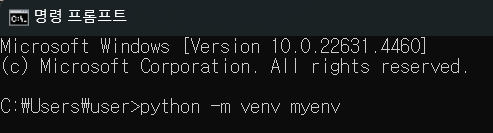
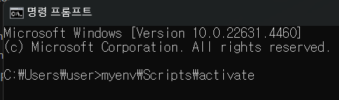
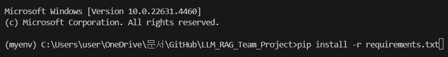
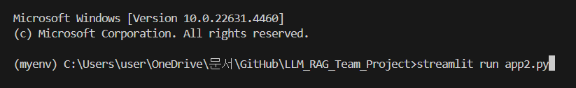

# JobGPT: AI 기반 IT 직무 탐색 및 추천

## 1️⃣ 프로젝트 개요

**JobGPT**는 취업 준비 과정에서 발생하는 정보 탐색의 어려움을 해결하기 위해 시작된 프로젝트입니다. 특히 Al/ML/CS와 같은 기술 중심 도메인에서는 정보가 방대하고 빠르게 변화하기 때문에, 필요한 정보를 찾는 데 많은 시간과 노력이 소요됩니다.

이 프로젝트는 **"채용 정보를 효율적으로 탐색하고, 사용자에게 필요한 정보를 신뢰할 수 있는 방식으로 제공한다면?"**이라는 질문에서 출발했습니다. JobGPT는 채용 공고 API를 활용하여 실시간으로 데이터를 수집하고, 이 데이터를 기반으로 취업 준비에 필요한 정보를 제공합니다.

## 2️⃣ 역할 분담

| 이름  | 역할  | 업무     |
|-------|-------|----------|
|강예진|프로젝트 매니저|프로젝트 일정 관리 및 문서화 작업, 데이터 크롤링
|유정석|백엔드 및 데이터 엔지니어|LangChain활용 데이터 처리 및 RAG 시스템 구현, 벡터 데이터베이스 설계 및 데이터 연결 관리
|장승환|백엔드 및 데이터 엔지니어|LangChain 기반 RAG 시스템 등 코드 리뷰를 통한 코드 품질 개선 기여
|강성민|프론트엔드 |와이어프레임 작성, 로직 흐름도, Streamlit & CSS 이용해서 UI 설계 및 구현
|정재혁|프론트엔드 |Streamlit & CSS를 이용해서 사용자 인터페이스 설계 및 구현

## 3️⃣ 프로젝트 일정

### 🗓️ Timeline

|날짜|업무|
|---|---|
|11.21 ~ 11.24 |기획 및 SA 문서 작성|
|11.25  |와이어프레임 작성|
|11.26 ~ 12.01| 데이터 수집 및 백엔드, 프론트엔드 작업|
|12.02 ~ 12.03| 백엔드 및 프론트엔드 연결|
|12.03| 최종 점검 및 결과보고서 작성|

## 4️⃣ 기능 소개

### 💡 핵심 기능

1. **직무 추천 및 상담**

- OpenAI GPT-4o 모델을 활용하여 사용자의 입력에 기반한 직무 추천 및 상담을 제공합니다.

2. **대화 기록 관리**

- 사용자별 세션 ID를 기반으로 대화 내용을 저장 및 불러올 수 있습니다.
- 대화 내용은 로컬 파일로 저장되며, 나중에 파일을 통해 불러올 수 있습니다.

3. **음성 입력 및 출력 지원**

- ElevenLabs API를 활용하여 텍스트 응답을 음성으로 변환해 제공합니다.
- 음성 입력 및 출력 기능은 사용자의 환경 설정에 따라 활성화됩니다.

4. **사용자 맞춤형 환경 제공**

- OpenAI 및 ElevenLabs API 키 입력을 통해 사용자의 맞춤형 환경을 지원합니다.

## 5️⃣ 실행 방법 및 코드 구성

### 실행 방법

#### 가상 환경 설정

1. 먼저 vscode의 터미널이나 cmd 환경에서 아래 문장 입력

'''python -m venv [가상환경이름]'''  

  

2. 가상환경에 접속

'''[가상환경명]\Scripts\activate'''  

  

3. [requirements.txt](./requirement.txt) 활용하여 패키지 설치

'''pip install -r requirements.txt'''  

  

#### Streamlit 실행

'''streamlit run app2.py''' 입력하여 streamlit 실행

[app2.py(클릭 후 터미널에 문구 입력)](./app2.py)  

  

### 🔍 주요 코드 설명

**Stramlit 기반 UI**  

- 이미지 및 CSS 적용: 프로젝트 로고와 CSS 스타일을 사용하여 사용자 친화적인 UI를 제공합니다.
- 사이드바: 세션 ID, API 키 입력, 이전 대화 불러오기, 언어 선택 등의 인터페이스를 제공합니다.

**OpenAI API와의 통합**  

- OpenAI GPT-4o 모델을 활용하여 사용자 질문에 대해 적절한 응답을 생성합니다.
- 대화 맥락과 다국어 지원을 위한 시스템 메시지를 동적으로 설정합니다.

**대화 저장 및 불러오기**  

- vectorDB에 이전 대화 내용들을 추가하면서 실시간으로 데이터를 업데이트합니다.
- save_chat_to_file: 대화 내용을 로컬 파일로 저장하는 함수
- load_chat_from_file: 저장된 대화 파일을 읽어오는 함수

**음성 입력 및 출력 지원**  

- ElvenLabs API를 사용하여 텍스트 응답을 음성으로 변환하고 재생할 수 있습니다.
- ~~사용자가 ElevenLabs API 키를 입력하지 않으면 음성 기능은 비활성화됩니다.~~

## 6️⃣ 트러블슈팅

<details>
<summary>세부 사항</summary>

### 정재혁

#### 문제 1

css를 이용해서 이미지를 가운데를 정렬하려고 했으나 가운데 정렬은 되지만 이미지가 뜨지 않음

```python
st.markdown("""
    <div style="text-align: center;">
        
    </div>
    """, unsafe_allow_html=True)
```

**해결 방법**  

streamlit 도큐먼트를 찾아보았지만 st.image 자체 함수에서 정렬하는 기능은 없어서 할수 없이 css의 div style를 사용했음. 하지만 가운데 정렬은 성공했지만, 이미지가 화면에 출력이 되지 않아 결국 상단 좌측에 로고로 출력하도록 수정.

#### 문제 2

ModuleNotFoundError: No module named 'openai.error'

**해결 방법**  

pip install openai==0.28 로 다운 그레이드

===========================

### 장승환

#### **ModuleNotFoundError**

1. **python-dotenv 모듈 재설치** : 아나콘다 프롬프트에서 pip uninstall python-dotenv 실행 후 재설치하였지만 해결 실패.

2. **pip list | grep python-dotenv**를 통해, 가상 환경에 python-dotenv가 설치되어 있는지 확인.
* python-dotenv             1.0.1

3. **코드 실행 환경 문제 검토** 결과는 문제 없었다.
(출력된 경로가 C:\Users\82103\anaconda4\envs\myenv\python.exe 로 Python의 실행 경로와 동일하게 나왔다.)

4. **PYTHONPATH 확인.**

* $ python -c "import sys; print(sys.path)" 실행. myenv 가상환경의 site-packages 디렉토리가 포함되어 있었다.
* 올바른 경로로 돼 있는 것을 확인.

5. **python llm_model_rag.py 실행하여 문제 해결.**

* Visual Studio Code 의 Run Code 버튼을 사용하는 것이 아닌, 터미널을 통해 python llm_model_rag.py를 실행 성공.


**정리**  
* 이 문제는 주로 Python 환경이 일치하지 않거나 패키지가 잘못 설치된 경우에 발생.
* python llm_model_rag.py 실행하니 문제가 없었다.

===========================

### 강성민

1. 스트림릿  스타일 구현 한계
- 문제 - 대화 형식의 챗봇이다보니 사용자가 입력한 말풍선을 우측 정렬이 필요했음. 스트림릿에서는 색상 및 우측정렬이 힘들어서 마크다운 함수를 이용하여 HTML/CSS 스타일을 적용시킴

- 해결 - HTML을 랜더링하기위한 st.markdown를 불러온 다음 CSS를 사용하여 스타일과 레이아웃을 만들었다.  
메시지 박스 우측정렬 - display, justify-content, align-items, margin  
메시지 박스 스타일 - background-color, color, padding, border-radius, max-width, text-align, font-size

===========================

### 유정석

1. __IP 차단 문제 해결__

- 특정 사이트(사람인)에서 headless 모드와 잦은 동적 크롤링으로 인해 봇으로 의심받아 IP가 차단되는 문제가 발생했음. 서버는 동일한 UserAgent로 반복 접근하거나 짧은 요청 간격으로 봇을 감지해 차단 조치를 취하는 구조였음.

- _해결 방안_ :  
    UserAgent를 랜덤으로 설정해 서버가 동일한 사용자로 인식하지 않도록 함.  
    WebDriver 실행 주기를 랜덤으로 설정해 사람이 접속하는 것처럼 위장했음.  
    이러한 방식으로 봇 의심 상황을 줄이고 크롤링 작업의 안정성을 확보할 수 있었음.  

</details>

## 7️⃣ 사용 기술 및 의사결정

**사용 기술**

- **언어 및 프레임워크:** Python (3.11), Streamlit, LangChain, HuggingFace, FAISS
- **데이터베이스:** FAISS Vectorstore (임베딩 저장 및 검색)
- **음성 처리:** PyAudio, SpeechRecognition, pydub
- **환경 관리:** Conda, Pip
- **UI/UX:** Streamlit을 활용한 사용자 친화적 대화 인터페이스, 커스터마이징 가능한 사이드바 및 다국어 지원 UI  


---


**주요 의사결정**

<details>
<summary>세부 사항</summary>

1. **LangChain 사용**

- **텍스트 청킹** 및 검색 기능이 강력한 LangChain을 기반으로 프로젝트 설계
- HuggingFace 임베딩 모델과 통합하여 사용자 입력 데이터와 문서 데이터간의 높은 검색 정확도를 보장
- 확장성 있는 구조 적분에 다양한 데이터 형식 지원 가능

2. **FAISS Vectorstore 도입**

- 대규모 데이터 처리를 효율적으로 지원하며, 실시간으로 데이터 업데이트 및 검색 기능 제공
- 사용자 재화 기록까지 벡터로 저장 및 검색 가능, 시스템의 유연성 강화

3. **다국어 지원 프롬프트 설계**

- 한국어 기반 사용자 환경을 고려한 다국어 지원 템플릿 설계
- PromptTemplate와 OpenAI API 시스템 메시지를 활용하여 한국어, 영어, 일본어, 중국어 등 다국어로 원활한 소통 지원

4. **오픈소스 라이브러리 활용**

- **SpeechRecognition**과 **pydub**을 사용해 직관적 음성 입력 및 텍스트 변환 제공
- ElevenLabs API를 통해 사용자 응답을 음성으로 출력하여 인터페이스의 활용성 향상
- PyAudio와 PortAudio로 음성 기능의 안정성을 확보

5. **Streamlit을 통한 인터페이스 개발**

- 사용자가 접근하기 쉽고 직관적인 UI를 구현하기 위해 Streamlit 도입
- 세션 관리 및 사이드바를 통해 대화 기록 저장, API 키 입력, 파일 업로드 기능 추가

6. **환경 관리**

- ~~Conda와 Pip을 병행 사용하여 필수 패키지와 의존성 관리~~

7. **사용자 중심 설계**

- 사용자 대화 기록을 텍스트 파일로 저장 및 불러오는 기능 제공
- **실시간 데이터 업데이트:** 사용자 입력 데이터를 기반으로 FAISS Vectorstore에 임베딩 저장 및 활용
- 선택 가능한 언어와 커스터마이징 가능한 세션 설정으로 편의성 강화

</details>